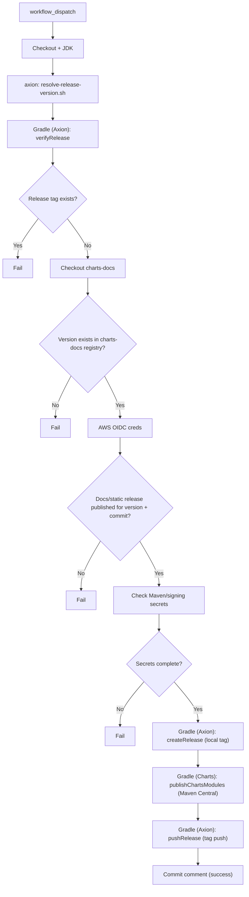

# Charts Release

Workflow: `charts/.github/workflows/release.yml`

Before running this workflow, complete the
[Release Checklist](./release-checklist.md). In particular, the docs promotion
pull request must be merged because this workflow requires the release version
in the charts-docs registry.

The workflow resolves the release version from Axion. If the release tag already
exists, the workflow fails before publishing.

The workflow also requires `Docs Release Publish` to have published versioned
docs/static assets for the same release version and charts commit before Maven
publishing can proceed.
