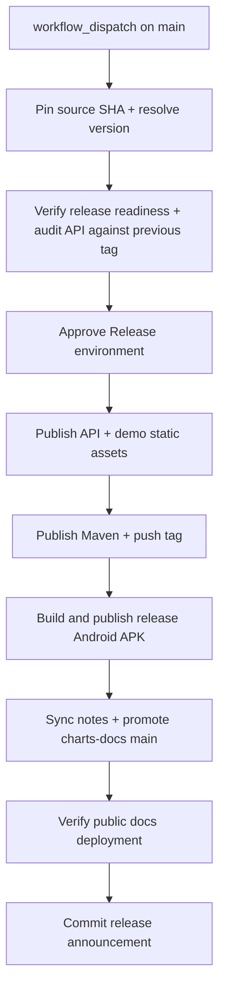

# Charts Release

Workflow: `charts/.github/workflows/release.yml`

Before running this workflow, complete the
[Release Checklist](./release-checklist.md). The workflow coordinates docs
promotion and static publication itself from the pinned charts commit.

The workflow resolves the release version from Axion. If the release tag already
exists, the workflow fails before publishing.

`Release` is the only manually runnable publishing workflow. Its optional
`replace_static_assets` input replaces pre-release API and demo objects for the
resolved version; leave it disabled for normal releases. The workflow must pass
the protected `Release Approval` environment before any production publication
begins.
