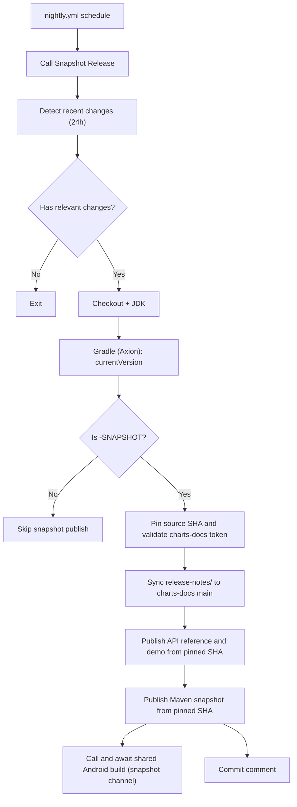

# Charts Snapshot

Workflow: `charts/.github/workflows/snapshot-release.yml`

`release-notes/<version>` is versioned without the `-SNAPSHOT` suffix. When that
directory exists, the workflow synchronizes it before publication so snapshot
pages use the same notes that will later accompany the release. A missing
release-note directory does not block snapshot publication; final releases
still require their versioned release notes. The shared `Android Build` workflow
checks out the pinned source SHA, matching `Snapshot Release`.

`Snapshot Release` and `Android Build` are reusable workflows without manual
triggers. `nightly.yml` remains the scheduled organizer.
