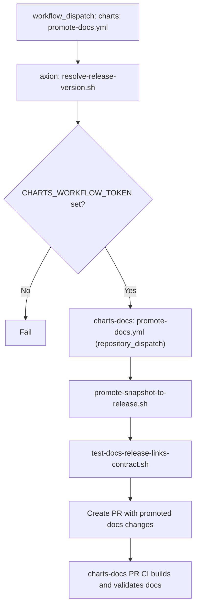

# Docs Promotion (Cross-Repo)

Workflow: `charts/.github/workflows/promote-docs.yml`

Notes:
- `promote-snapshot-to-release.sh`: copies `content/snapshot` to `content/{release_version}` and updates registry.
- The release version is resolved automatically by the charts workflow. The
  registry description is generated as `Release {release_version}`; promotion
  has no editable version or description input.
- Versioned release notes remain under `release-notes/{release_version}` and
  are not copied or reset during promotion.
- The charts-docs workflow is an internal receiver on the default branch and
  cannot be started from the Actions manual-run form.
