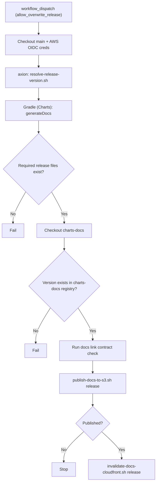

# Docs Release Publish

Workflow: `charts/.github/workflows/publish-docs-release.yml`

Required release files:
- `docs/static/api/{release_version}/index.html`
- `docs/static/demo/{release_version}/index.html`

The release version is resolved from Axion at runtime. The manual run form only
contains the overwrite control for existing release assets.

Run this workflow before `Release`; the library release checks the S3 metadata
and required versioned docs objects before publishing Maven artifacts.
