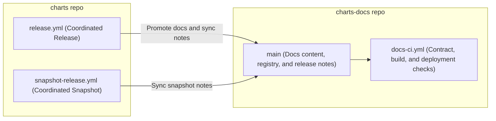

# High-Level Map

```mermaid
flowchart LR
  subgraph CHARTS["charts repo"]
    A["release.yml (Coordinated Release)"]
    B["snapshot-release.yml (Coordinated Snapshot)"]
  end

  subgraph CHARTS_DOCS["charts-docs repo"]
    C["main (Docs content, registry, and release notes)"]
    D["docs-ci.yml (Contract, build, and deployment checks)"]
  end

  A -->|"Promote docs and sync notes"| C
  B -->|"Sync snapshot notes"| C
  C --> D
```
