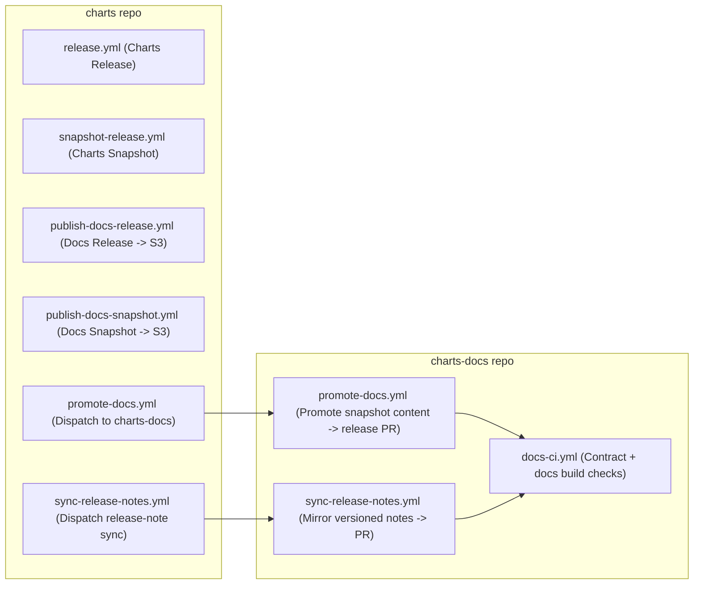

# High-Level Map

```mermaid
flowchart LR
  subgraph CHARTS["charts repo"]
    A["release.yml (Charts Release)"]
    B["snapshot-release.yml (Charts Snapshot)"]
    C["publish-docs-release.yml (Docs Release -> S3)"]
    D["publish-docs-snapshot.yml (Docs Snapshot -> S3)"]
    E["promote-docs.yml (Dispatch to charts-docs)"]
    H["sync-release-notes.yml (Dispatch release-note sync)"]
  end

  subgraph CHARTS_DOCS["charts-docs repo"]
    F["promote-docs.yml (Promote snapshot content -> release PR)"]
    G["docs-ci.yml (Contract + docs build checks)"]
    I["sync-release-notes.yml (Mirror versioned notes -> PR)"]
  end

  E --> F
  F --> G
  H --> I
  I --> G
```
