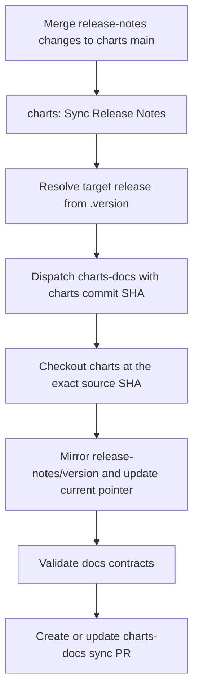

# Release Notes Sync

Workflows:

- `charts/.github/workflows/sync-release-notes.yml`
- `charts-docs/.github/workflows/sync-release-notes.yml`

The charts workflow runs automatically when `release-notes/**` changes on
`main`. Run it manually after workflow maintenance, after recovering from a
failed dispatch, or when charts-docs needs to be reconciled with the current
charts source without changing a release-note file.

The charts-docs workflow is an internal `repository_dispatch` receiver on its
default branch. Manual retries and reconciliation always start from the charts
workflow.

Before promoting snapshot docs to a release, merge the latest release-note sync
pull request so the released docs can resolve every merged charts change.

The docs app reads the mirrored fragments directly. Snapshot pages follow the
current-version pointer until that version appears in the release registry;
released pages use their matching version directory. Promotion does not copy or
reset release-note files.
