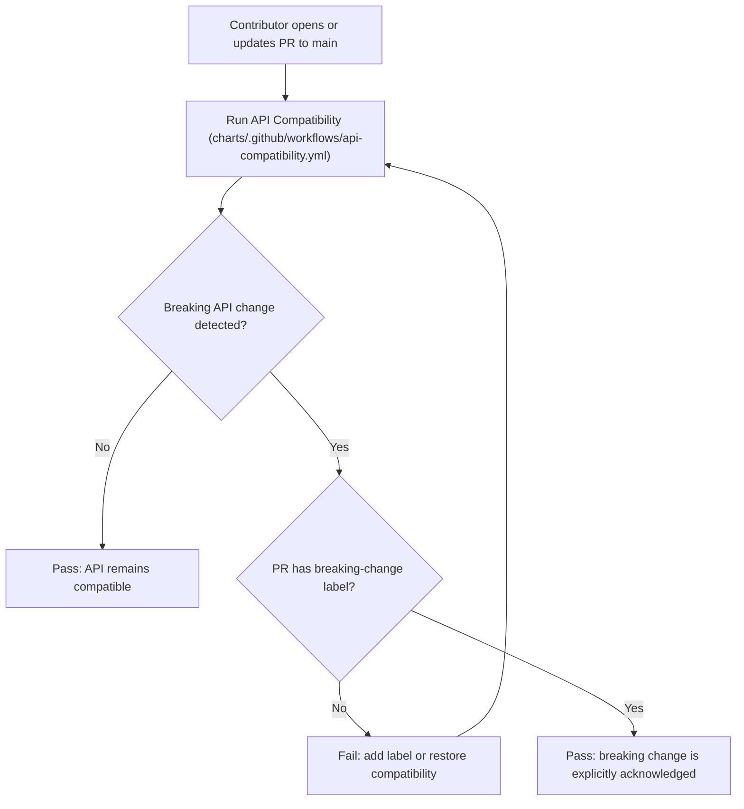
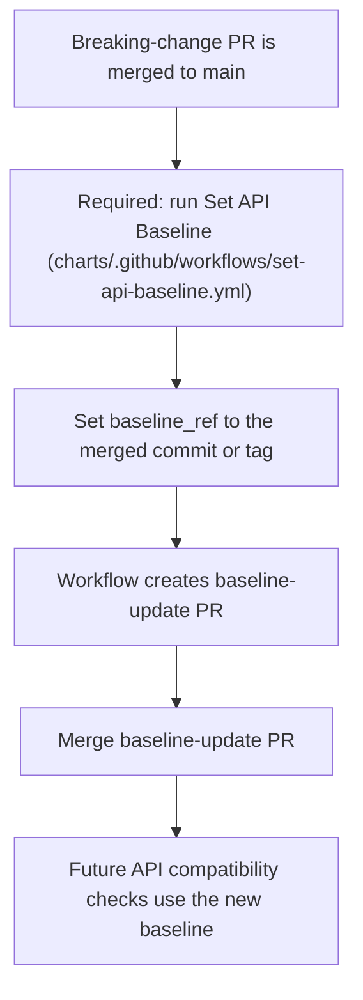

# API Compatibility

Workflows:
- `API Compatibility` — `charts/.github/workflows/api-compatibility.yml`
- `Set API Baseline` — `charts/.github/workflows/set-api-baseline.yml` (post-merge baseline update)

## PR Compatibility Flow

If a breaking change is acknowledged and merged, always run the post-merge baseline update flow below.

## Post-Merge Baseline Update Flow

