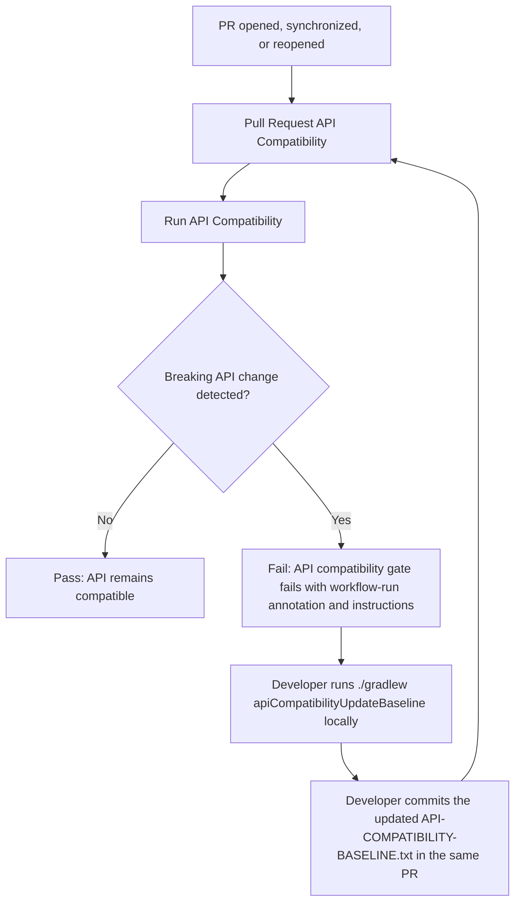

# API Compatibility

Workflows:
- `Pull Request API Compatibility` — `charts/.github/workflows/pull-request-api.yml` (pull-request orchestration)
- `API Compatibility` — `charts/.github/workflows/api-compatibility.yml` (reusable compatibility check)

## PR Compatibility Flow


```mermaid
 flowchart TD
   A["PR opened, synchronized, or reopened"] --> B["Pull Request API Compatibility"]
   B --> C["Run API Compatibility"]
   C --> D{"Breaking API change detected?"}
   D -- No --> E["Pass: API remains compatible"]
   D -- Yes --> F["Fail: API compatibility gate fails with workflow-run annotation and instructions"]
   F --> G["Developer runs ./gradlew apiCompatibilityUpdateBaseline locally"]
   G --> H["Developer commits the updated API-COMPATIBILITY-BASELINE.txt in the same PR"]
   H --> B
```

The `Pull Request API Compatibility` workflow runs for the `opened`,
`synchronize`, and `reopened` pull-request actions, including documentation-only
changes. When the compatibility check detects a binary or source-incompatible
public API change, the workflow fails the API gate and posts a workflow-run
annotation that points the developer at `./gradlew apiCompatibilityUpdateBaseline`.
The developer runs that task locally, commits the regenerated
`API-COMPATIBILITY-BASELINE.txt` in the same pull request, and pushes
again. The next run compares the new commit against the updated baseline and
passes.

## Release Audit Flow

`Release` automatically compares the pinned release source against the latest
published SemVer tag. The checked-in
`API-COMPATIBILITY-BASELINE.txt` may already have advanced after
breaking-change PRs merged the updated baseline file, so the release audit
intentionally uses the previous tag instead.

To reproduce the audit locally, run:

```bash
./gradlew apiCompatibilityCheck --no-daemon --continue -PapiCompatibilityBaselineRef=<previous-release-tag>
```

Example for a `2.3.0` release whose previous release is `2.2.0`:

```bash
./gradlew apiCompatibilityCheck --no-daemon --continue -PapiCompatibilityBaselineRef=2.2.0
```

## Acknowledging an Intentional Breaking Change

1. Push the breaking change. The API compatibility workflow will fail the PR
   and post a workflow-run annotation with instructions.
2. Run `./gradlew apiCompatibilityUpdateBaseline` locally. It writes the
   current HEAD SHA into `API-COMPATIBILITY-BASELINE.txt`.
3. Commit the regenerated `API-COMPATIBILITY-BASELINE.txt` in the same
   pull request and push. The next run uses the new baseline and passes.
