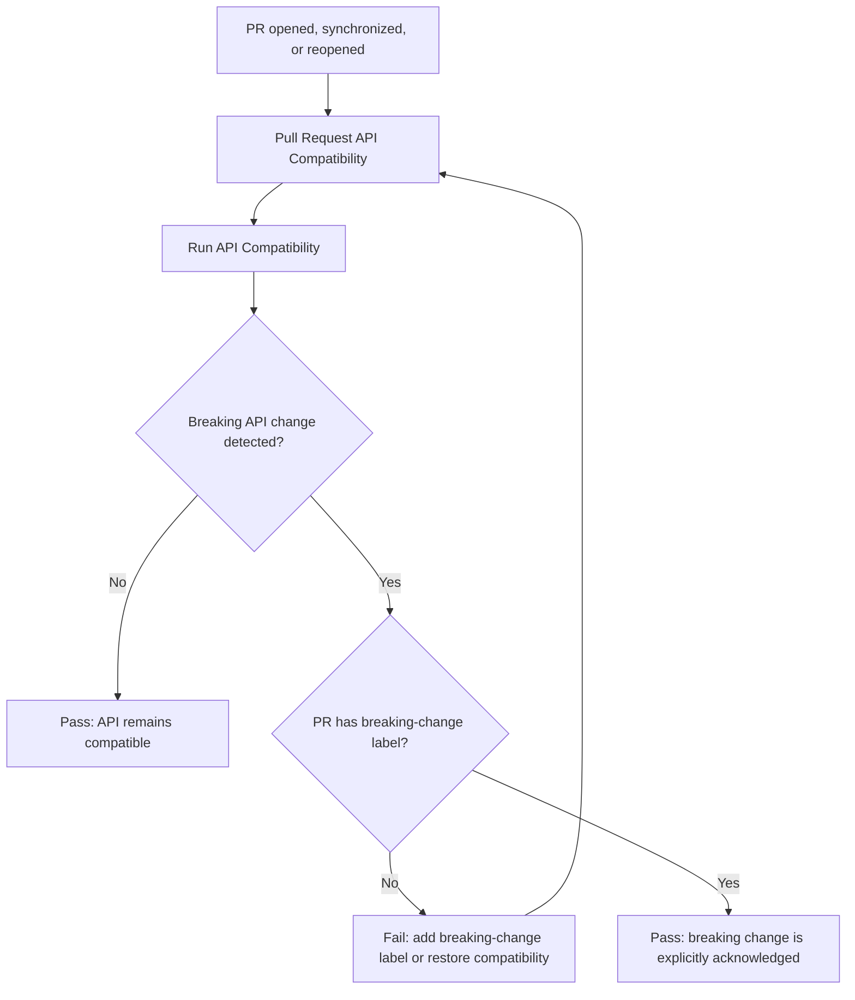
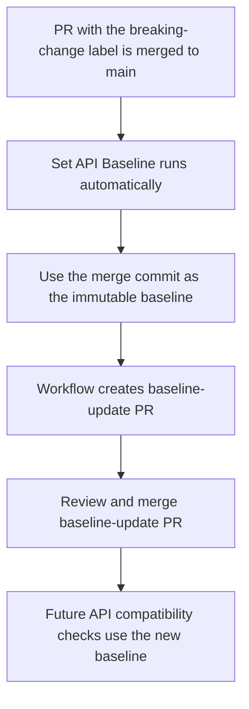

# API Compatibility

Workflows:
- `Pull Request API Compatibility` — `charts/.github/workflows/pull-request-api.yml` (pull-request orchestration)
- `API Compatibility` — `charts/.github/workflows/api-compatibility.yml` (reusable compatibility check)
- `Set API Baseline` — `charts/.github/workflows/set-api-baseline.yml` (post-merge baseline update)

## PR Compatibility Flow


```mermaid
flowchart TD
  A["PR opened, synchronized, or reopened"] --> B["Pull Request API Compatibility"]
  B --> C["Run API Compatibility"]
  C --> D{"Breaking API change detected?"}
  D -- No --> E["Pass: API remains compatible"]
  D -- Yes --> F{"PR has breaking-change label?"}
  F -- No --> G["Fail: add breaking-change label or restore compatibility"]
  F -- Yes --> H["Pass: breaking change is explicitly acknowledged"]

  G --> B
```

The `Pull Request API Compatibility` workflow runs for the `opened`,
`synchronize`, and `reopened` pull-request actions. It runs the Gradle
compatibility check for every such event, including documentation-only changes.
The `breaking-change` label is evaluated as policy input: it allows an
intentional API break but does not trigger a separate workflow run.

The compatibility job fetches current PR labels from the GitHub API on each
attempt rather than using the original event's label snapshot. After adding
`breaking-change` for an intentional incompatibility, use **Re-run failed jobs**
or **Re-run all jobs** to evaluate it without pushing another commit.

If a breaking change is acknowledged with the `breaking-change` label and
merged, the post-merge baseline update flow below runs automatically.

## Release Audit Flow

`Release` automatically compares the pinned release source against the latest
published SemVer tag. The checked-in
`.github/api-compatibility-baseline.txt` may already have advanced after
accepted breaking-change PRs merge, so the release audit intentionally uses the
previous tag instead.

To reproduce the audit locally, run:

```bash
./gradlew apiCompatibilityCheck --no-daemon --continue -PapiCompatibilityBaselineRef=<previous-release-tag>
```

Example for a `2.3.0` release whose previous release is `2.2.0`:

```bash
./gradlew apiCompatibilityCheck --no-daemon --continue -PapiCompatibilityBaselineRef=2.2.0
```

## Post-Merge Baseline Update Flow


```mermaid
flowchart TD
  A["PR with the breaking-change label is merged to main"] --> B["Set API Baseline runs automatically"]
  B --> C["Use the merge commit as the immutable baseline"]
  C --> D["Workflow creates baseline-update PR"]
  D --> E["Review and merge baseline-update PR"]
  E --> F["Future API compatibility checks use the new baseline"]
```
