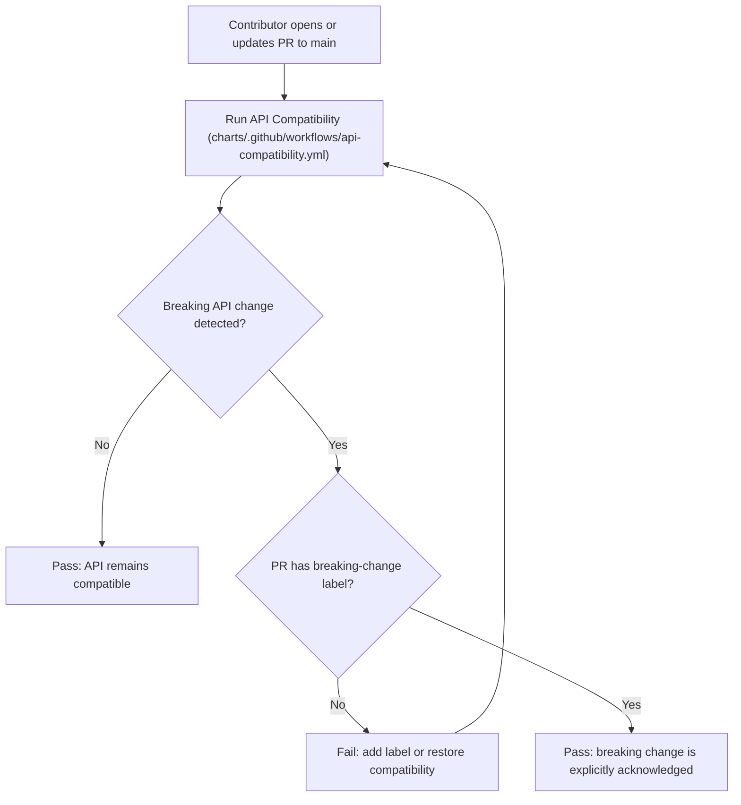
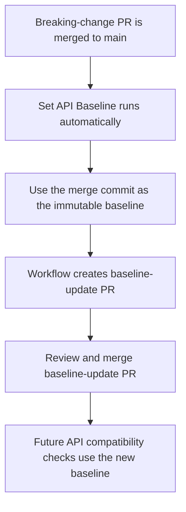

# API Compatibility

Workflows:
- `API Compatibility` — `charts/.github/workflows/api-compatibility.yml`
- `Set API Baseline` — `charts/.github/workflows/set-api-baseline.yml` (post-merge baseline update)

## PR Compatibility Flow


```mermaid
flowchart TD
  A["Contributor opens or updates PR to main"] --> B["Run API Compatibility (charts/.github/workflows/api-compatibility.yml)"]
  B --> C{"Breaking API change detected?"}
  C -- No --> D["Pass: API remains compatible"]
  C -- Yes --> E{"PR has breaking-change label?"}
  E -- No --> F["Fail: add label or restore compatibility"]
  E -- Yes --> G["Pass: breaking change is explicitly acknowledged"]

  F --> B
```

If a breaking change is acknowledged and merged, the post-merge baseline update
flow below runs automatically.

## Release Audit Flow

`Release` automatically compares the pinned release source against the latest
published SemVer tag. The checked-in
`.github/api-compatibility-baseline.txt` may already have advanced after
accepted breaking-change PRs merge, so the release audit intentionally uses the
previous tag instead.

To reproduce the audit locally, run:

```bash
./gradlew apiCompatibilityCheck --no-daemon --continue -PapiCompatibilityBaselineRef=<previous-release-tag>
```

Example for a `2.3.0` release whose previous release is `2.2.0`:

```bash
./gradlew apiCompatibilityCheck --no-daemon --continue -PapiCompatibilityBaselineRef=2.2.0
```

## Post-Merge Baseline Update Flow


```mermaid
flowchart TD
  A["Breaking-change PR is merged to main"] --> B["Set API Baseline runs automatically"]
  B --> C["Use the merge commit as the immutable baseline"]
  C --> D["Workflow creates baseline-update PR"]
  D --> E["Review and merge baseline-update PR"]
  E --> F["Future API compatibility checks use the new baseline"]
```
