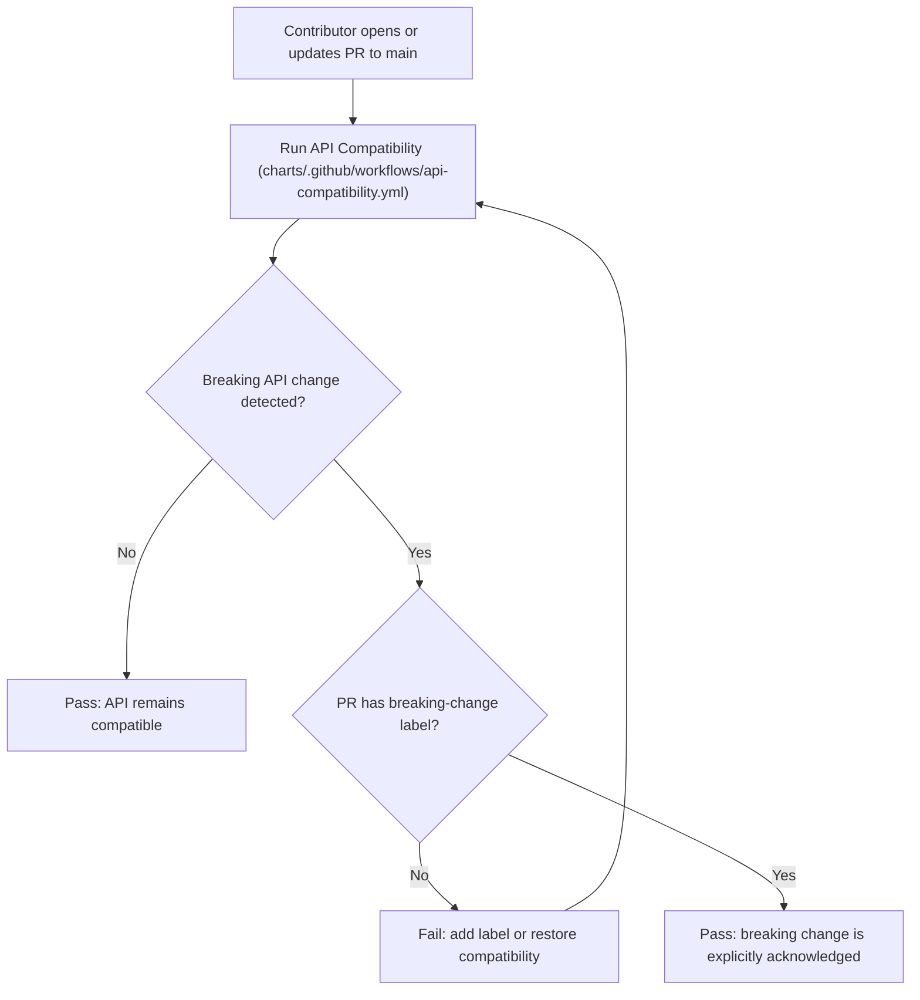
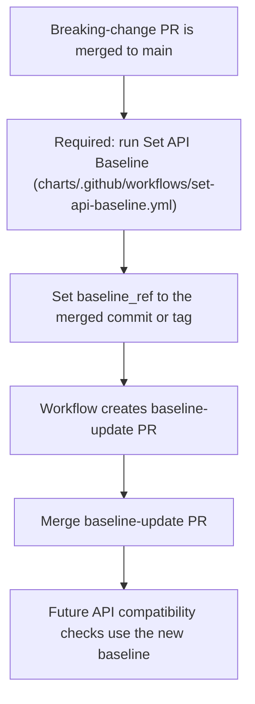

# API Compatibility

Workflows:
- `API Compatibility` — `charts/.github/workflows/api-compatibility.yml`
- `Set API Baseline` — `charts/.github/workflows/set-api-baseline.yml` (post-merge baseline update)

## PR Compatibility Flow


```mermaid
flowchart TD
  A["Contributor opens or updates PR to main"] --> B["Run API Compatibility (charts/.github/workflows/api-compatibility.yml)"]
  B --> C{"Breaking API change detected?"}
  C -- No --> D["Pass: API remains compatible"]
  C -- Yes --> E{"PR has breaking-change label?"}
  E -- No --> F["Fail: add label or restore compatibility"]
  E -- Yes --> G["Pass: breaking change is explicitly acknowledged"]

  F --> B
```

If a breaking change is acknowledged and merged, always run the post-merge baseline update flow below.

## Release Audit Flow

For release readiness, compare against the previous published release tag, not
necessarily the checked-in `.github/api-compatibility-baseline.txt`. The checked-in
baseline may be advanced after accepted breaking-change PRs merge, so it can be
newer than the previous release.

Run the manual workflow with `baseline_ref` set to the previous release tag, or
run Gradle locally with:

```bash
./gradlew apiCompatibilityCheck --no-daemon --continue -PapiCompatibilityBaselineRef=<previous-release-tag>
```

Example for a `2.3.0` release whose previous release is `2.2.0`:

```bash
./gradlew apiCompatibilityCheck --no-daemon --continue -PapiCompatibilityBaselineRef=2.2.0
```

## Post-Merge Baseline Update Flow


```mermaid
flowchart TD
  A["Breaking-change PR is merged to main"] --> B["Required: run Set API Baseline (charts/.github/workflows/set-api-baseline.yml)"]
  B --> C["Set baseline_ref to the merged commit or tag"]
  C --> D["Workflow creates baseline-update PR"]
  D --> E["Merge baseline-update PR"]
  E --> F["Future API compatibility checks use the new baseline"]
```
