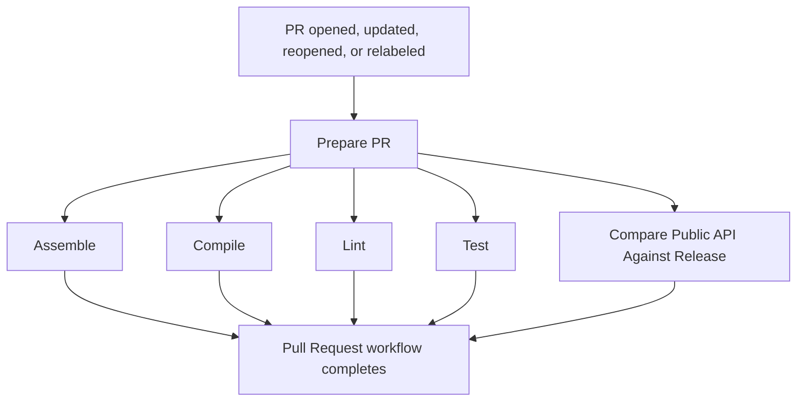

# Pull Request Orchestration

The pull-request CI is coordinated by
`.github/workflows/pull-request.yml`. It runs all PR checks against the same
immutable merge revision.

## Flow



`Assemble`, `Compile`, `Lint`, `Test`, and API compatibility run in parallel
after `Prepare PR`. The parent workflow completes only after all of them have
finished, and its result reflects any failed, cancelled, or skipped job.

## Workflow responsibilities

| Workflow or job | Responsibility |
| --- | --- |
| `Prepare PR` | Checks out the repository, detects code changes, records the merge revision, and reads the `breaking-change` label. |
| `Assemble` | Runs `./gradlew ciAssemble`. |
| `Compile` | Runs `./gradlew ciCompile`. |
| `Lint` | Runs Kotlin and build-logic lint when the PR contains code/build changes. |
| `Test` | Runs `ciTestJvm`, `ciTestAndroid`, `ciTestWeb`, and `ciTestIos` when needed; uploads Gradle's native HTML and XML reports. |
| `Compare Public API Against Release` | Runs `./gradlew apiCompatibilityCheck`; a detected breaking change requires the `breaking-change` label. |

Gradle's `chartsTest*` tasks are platform-specific commands for local use. The
`ciTest*`, `ciCompile`, and `ciAssemble` tasks are CI entry points; they define
the exact scope invoked by the reusable workflows. The `smoke-line` consumer
compile belongs only to `ciCompile`, not to a test task.

The reusable workflows receive `source-sha` from `Prepare PR`, so each check
uses the same merge result even if a later PR event starts another run. Every
validation workflow also receives the shared code-change decision from
`Prepare PR` and skips its job when the change is documentation-only.

## Merge protection

The `protect main` branch ruleset should require the validation checks:

```text
PR Assemble / Assemble
PR Compile / Compile
PR Lint / Lint
PR Test / JVM Tests
PR Test / Android Tests
PR Test / Wasm Tests
PR Test / iOS Tests
PR Compare Public API Against Release / Compare Public API Against Release
```

These checks directly represent the work that protects the branch. Reporting
and artifact publication are informational and must not be merge gates.

## Fork PR security boundary

The `Pull Request` workflow runs on `pull_request` with read-only repository
permissions. This is where untrusted PR code is checked out and executed.

Do not move build or test steps to `pull_request_target`; that event has write
access and must not execute untrusted PR code.

## Docs-only changes

`scripts/ci-has-code-changes.sh` treats documentation and release-note-only
changes as non-code changes. `Prepare PR` still runs, while the assemble,
compile, lint, test, and API compatibility jobs are skipped before their
runners start. Their required checks report success as skipped jobs.

## Troubleshooting

- **The PR cannot merge:** inspect the required status-check names in the
  `protect main` ruleset. Reusable workflows can expose check names differently
  after the first rollout, so use the exact names shown on the PR checks page.
- **Tests fail:** inspect the relevant `PR Test` job logs (JVM, Android, Wasm, or iOS) and download its test-report artifact for Gradle's HTML and XML reports.
- **API compatibility fails:** add the `breaking-change` label only when the
  API break is intentional; unrelated Gradle or compatibility errors are not
  bypassed by the label.
