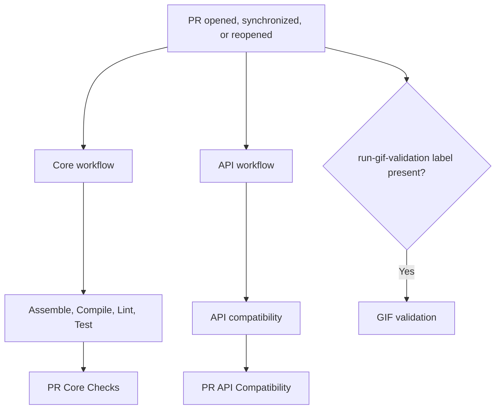

# Pull Request Orchestration

Pull-request CI is split into three independently triggered workflows: core
checks, API compatibility, and optional GIF validation. Core checks and API
compatibility use separate concurrency groups. Each workflow uses the immutable
`github.sha` for the pull-request event that started it.

## Labels

- `run-gif-validation` opts a pull request into GIF baseline validation. The
  validation runs for normal pull-request events while this label is present.
  Adding or removing the label does not trigger a separate validation run. It
  is informational and is not a required status check.

After changing `run-gif-validation`, use **Re-run all jobs** in the GIF workflow so its
label-check job fetches the current labels before deciding whether to validate.
Failed-job-only reruns reuse the output of a previously successful label check.

## Flow



The core workflow runs only for the `opened`, `synchronize`, and `reopened`
pull-request actions. Its `PR Core Checks` gate fails if preparation or any
dependent core check fails or is cancelled. The API workflow uses the same
actions and its `PR API Compatibility` gate fails if preparation or the
compatibility check fails or is cancelled. Documentation-only changes use
each reusable workflow's `Docs-only no-op` job instead of its real validation
job.

The API workflow listens for the same three pull-request actions as the core
workflow. Its `Prepare PR` job runs the same code-change detector and skips
the compatibility check on documentation-only pull requests. Its
`PR API Compatibility` gate reports the reusable workflow result as the
required status check; on docs-only pull requests the gate is skipped rather
than reported as success.

The GIF workflow is opt-in. Its label-check job runs on the three normal
pull-request actions and fetches current labels from the GitHub API; the
validation job runs only when `run-gif-validation` is present. Its
`pr-gif-<PR number>` concurrency group cancels an active validation when a new
commit supersedes it. Adding or removing the label alone does not start or
cancel validation. When the label is present, the resulting
`PR GIF Baseline Validation` status check is required by the
`protect main` ruleset, so merges wait for it to pass.

Docs GIFs record in landscape. `validate-gifs.yml` rotates the emulator with
`adb shell settings put system user_rotation 1` before running
`validateDocsGifBaselines`.

## Workflow responsibilities

| Workflow or job | Responsibility |
| --- | --- |
| `Prepare PR` | Checks out the repository, detects code changes, and records the merge revision for core and API checks. |
| `Assemble` | Runs `./gradlew ciAssemble`. |
| `Compile` | Runs `./gradlew ciCompile`. |
| `Lint` | Runs Kotlin and build-logic lint when the PR contains code/build changes. |
| `Test` | Runs `ciTestJvm`, `ciTestAndroid`, `ciTestWeb`, and `ciTestIos` when needed; uploads Gradle's native HTML and XML reports. |
| `PR API Compatibility` | Runs the API compatibility check on code/build-changing pull-request events and reports the required result; docs-only pull requests skip the check and report as skipped. |
| `API compatibility` | Runs `./gradlew apiCompatibilityCheck`; a detected public API incompatibility fails the PR with a workflow-run annotation that instructs the developer to run `./gradlew apiCompatibilityUpdateBaseline` and commit the updated baseline in the same PR. |
| `GIF validation` | Runs the opt-in GIF baseline workflow while the `run-gif-validation` label is present. |

Gradle's `chartsTest*` tasks are platform-specific commands for local use. The
`ciTest*`, `ciCompile`, and `ciAssemble` tasks are CI entry points; they define
the exact scope invoked by the reusable workflows. The `smoke-line` consumer
compile belongs only to `ciCompile`, not to a test task.

The core reusable workflows receive `source-sha` from `Prepare PR`. The API
workflow's `Prepare PR` job records the same merge revision and passes it to
the reusable workflow; the GIF validation workflow receives the triggering
event's `github.sha` directly, so each check uses the immutable merge result
for that event. Core checks and API compatibility retain their code-change
optimization; API compatibility detects breaking changes directly without
using labels.

## Merge protection

The `protect main` branch ruleset requires these stable final gates:

```text
PR Core Checks
PR API Compatibility
PR GIF Baseline Validation
```

`PR Core Checks` and `PR API Compatibility` are required on every pull
request. `PR GIF Baseline Validation` is required but is only posted by the
`Pull Request GIF Validation` workflow when the `run-gif-validation` label
is present; with `strict_required_status_checks_policy: false`, a missing
required check does not block the merge, so unlabeled pull requests skip the
GIF run while labeled pull requests are blocked until validation passes.

A documentation-only pull request skips `PR Core Checks`' real validation jobs
and skips `PR API Compatibility` entirely; the required status check reports
as skipped on the PR checks page. Configure the ruleset to treat skipped
required checks as non-blocking, or rely on GitHub's default behavior, so
docs-only pull requests can still merge.

## Fork PR security boundary

All three pull-request workflows run on `pull_request` with read-only
repository permissions. This is where untrusted PR code is checked out and
executed.

Do not move build or test steps to `pull_request_target`; that event has write
access and must not execute untrusted PR code.

## Non-code changes

`scripts/ci-has-code-changes.sh` treats documentation, release-note, agent
guidance, and repository-metadata-only changes as non-code changes. Both the
core workflow and the API workflow skip their real validation jobs for
documentation-only pull requests and use the `Docs-only no-op` job instead.

The snapshot release workflow uses the same script with the `snapshot` profile.
Release notes, GIF baselines, scripts, and other release-relevant changes remain
snapshot triggers.

## Reusable workflow status display

The reusable core and API workflows define two mutually exclusive paths for
their validation jobs:

- the real validation job, such as `Assemble` or `Compare Public API Against Baseline`;
- an explicit docs-only no-op job named `Docs-only no-op`.

GitHub displays both job definitions in the run, even though only one path is
selected. Therefore, a code-changing pull request can show
`Docs-only no-op` while the real validation job is running and
passing. That skipped row is the inactive alternative; it does not mean that
the pull request had no code changes and is not an additional required check.

For a docs-only pull request, the no-op job succeeds and the real validation
job is skipped for both the core workflow and the API compatibility workflow.
The aggregate `PR Core Checks` job verifies the core no-op path, and
`PR API Compatibility` is skipped because the reusable workflow selected its
`Docs-only no-op` path.

The opt-in `PR GIF Baseline Validation` job is different: when it is skipped,
the `run-gif-validation` label was not present and GIF validation was not
requested. A missing required check does not block merges under the
non-strict ruleset policy used by `protect main`.

## Troubleshooting

- **The PR cannot merge:** inspect the required status-check names in the
  `protect main` ruleset. Reusable workflows can expose check names differently
  after the first rollout, so use the exact names shown on the PR checks page.
- **Tests fail:** inspect the relevant `PR Test` job logs (JVM, Android, Wasm, or iOS) and download its test-report artifact for Gradle's HTML and XML reports.
- **API compatibility fails:** when a detected public API incompatibility is
  intentional, run `./gradlew apiCompatibilityUpdateBaseline` locally, commit
  the updated `API-COMPATIBILITY-BASELINE.txt` in the same pull
  request, and push. Unrelated Gradle or compatibility errors are not bypassed
  by updating the baseline.
