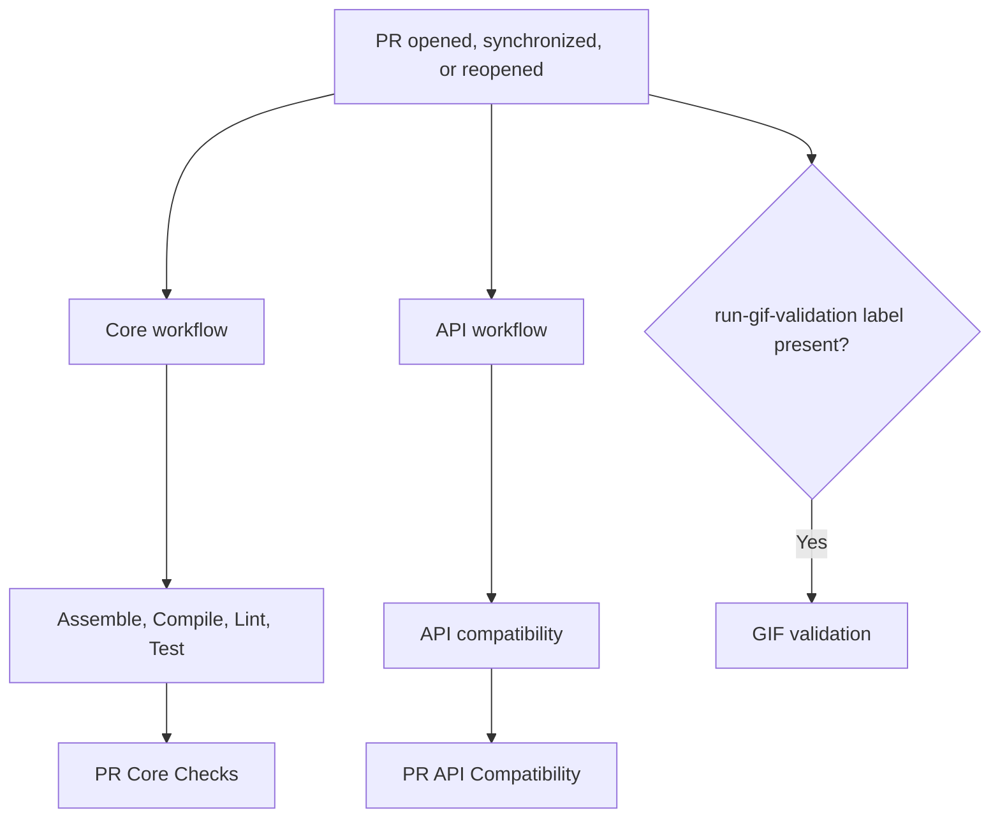

# Pull Request Orchestration

Pull-request CI is split into three independently triggered workflows: core
checks, API compatibility, and optional GIF validation. Core checks and API
compatibility use separate concurrency groups. Each workflow uses the immutable
`github.sha` for the pull-request event that started it.

## Labels

- `breaking-change` marks an intentional public API incompatibility. The API
  compatibility job fetches current labels from the GitHub API on every attempt,
  including failed-job reruns. Adding or removing it does not trigger a separate
  API run.
- `run-gif-validation` opts a pull request into GIF baseline validation. The
  validation runs for normal pull-request events while this label is present.
  Adding or removing the label does not trigger a separate validation run. It
  is informational and is not a required status check.

After changing `breaking-change`, rerun the failed API jobs or all jobs. After
changing `run-gif-validation`, use **Re-run all jobs** in the GIF workflow so its
label-check job fetches the current labels before deciding whether to validate.
Failed-job-only reruns reuse the output of a previously successful label check.

## Flow



The core workflow runs only for the `opened`, `synchronize`, and `reopened`
pull-request actions. Its `PR Core Checks` gate fails if preparation or any
dependent core check fails or is cancelled. Documentation-only changes still
use the reusable workflows' successful no-op path.

The API workflow listens for the same three pull-request actions as the core
workflow and always runs the compatibility check. Its `PR API Compatibility`
gate reports the reusable workflow result as the required status check.

The GIF workflow is optional. Its label-check job runs on the three normal
pull-request actions and fetches current labels from the GitHub API; the
validation job runs only when `run-gif-validation` is present. Its
`pr-gif-<PR number>` concurrency group cancels an active validation when a new
commit supersedes it. Adding or removing the label alone does not start or
cancel validation.

## Workflow responsibilities

| Workflow or job | Responsibility |
| --- | --- |
| `Prepare PR` | Checks out the repository, detects code changes, and records the merge revision for core checks. |
| `Assemble` | Runs `./gradlew ciAssemble`. |
| `Compile` | Runs `./gradlew ciCompile`. |
| `Lint` | Runs Kotlin and build-logic lint when the PR contains code/build changes. |
| `Test` | Runs `ciTestJvm`, `ciTestAndroid`, `ciTestWeb`, and `ciTestIos` when needed; uploads Gradle's native HTML and XML reports. |
| `PR API Compatibility` | Runs the API compatibility check for every normal pull-request event and reports the required result. |
| `API compatibility` | Runs `./gradlew apiCompatibilityCheck`; a detected public API incompatibility requires the `breaking-change` label. |
| `GIF validation` | Runs the opt-in GIF baseline workflow while the `run-gif-validation` label is present. |

Gradle's `chartsTest*` tasks are platform-specific commands for local use. The
`ciTest*`, `ciCompile`, and `ciAssemble` tasks are CI entry points; they define
the exact scope invoked by the reusable workflows. The `smoke-line` consumer
compile belongs only to `ciCompile`, not to a test task.

The core reusable workflows receive `source-sha` from `Prepare PR`. API and
GIF validation receive the triggering event's `github.sha`, so each check uses
the immutable merge result for that event. Core checks retain their
code-change optimization; API compatibility always runs for normal
pull-request events and uses the `breaking-change` label only as policy input.

## Merge protection

The `protect main` branch ruleset requires only these stable final gates:

```text
PR Core Checks
PR API Compatibility
```

Do not require `Prepare PR`, individual implementation jobs, or `PR GIF Baseline
Validation`; GIF validation is optional. Rulesets match status-check contexts
literally, so keep the required names exactly as shown above.

## Fork PR security boundary

All three pull-request workflows run on `pull_request` with read-only
repository permissions. This is where untrusted PR code is checked out and
executed.

Do not move build or test steps to `pull_request_target`; that event has write
access and must not execute untrusted PR code.

## Docs-only changes

`scripts/ci-has-code-changes.sh` treats documentation and release-note-only
changes as non-code changes for the core workflow. The API compatibility
workflow still runs for those changes because it always checks the current
public API against the baseline.

## Reusable workflow status display

The reusable core workflows define two mutually exclusive paths for some
checks:

- the real validation job, such as `Assemble`;
- an explicit docs-only no-op job named `Docs-only no-op`.

GitHub displays both job definitions in the run, even though only one path is
selected. Therefore, a code-changing pull request can show
`Docs-only no-op` while the real validation job is running and
passing. That skipped row is the inactive alternative; it does not mean that
the pull request had no code changes and is not an additional required check.

For a docs-only pull request, the no-op job succeeds and the real validation
job is skipped for the core workflow, while API compatibility still runs. The
aggregate `PR Core Checks` job verifies the core no-op path, and
`PR API Compatibility` verifies the API result.

The optional `PR GIF Baseline Validation` job is different: when it is skipped,
the `run-gif-validation` label was not present and GIF validation was not
requested.

## Troubleshooting

- **The PR cannot merge:** inspect the required status-check names in the
  `protect main` ruleset. Reusable workflows can expose check names differently
  after the first rollout, so use the exact names shown on the PR checks page.
- **Tests fail:** inspect the relevant `PR Test` job logs (JVM, Android, Wasm, or iOS) and download its test-report artifact for Gradle's HTML and XML reports.
- **API compatibility fails:** add the `breaking-change` label only when a
  detected public API incompatibility is intentional; unrelated Gradle or
  compatibility errors are not bypassed by this label.
