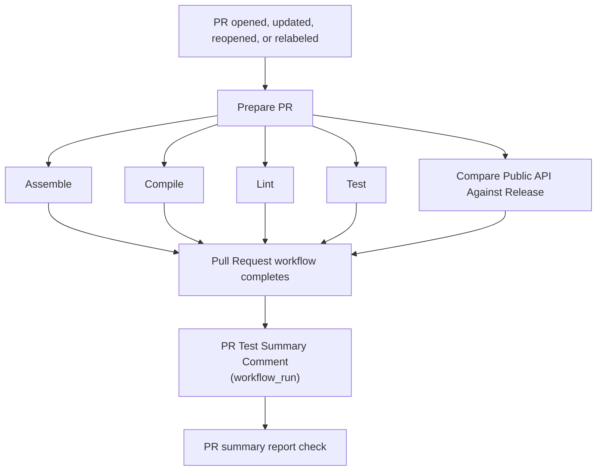

# Pull Request Orchestration

The pull-request CI is coordinated by
`.github/workflows/pull-request.yml`. It runs all PR checks against the same
immutable merge revision. A trusted downstream workflow collects the test
summary and publishes the report check used as the merge gate.

## Flow



`Assemble`, `Compile`, `Lint`, `Test`, and API compatibility run in parallel
after `Prepare PR`. The parent workflow completes only after all of them have
finished, and its result reflects any failed, cancelled, or skipped job.

The comment workflow is deliberately downstream and separate. GitHub starts
`.github/workflows/pr-test-summary-comment.yml` after the `Pull Request`
workflow completes. After publishing the comment, it reports the stable
`PR summary report` check on the PR merge commit.

## Workflow responsibilities

| Workflow or job | Responsibility |
| --- | --- |
| `Prepare PR` | Checks out the repository, detects code changes, records the merge revision, and reads the `breaking-change` label. |
| `Assemble` | Runs `./gradlew ciAssemble`. |
| `Compile` | Runs `./gradlew ciCompile`. |
| `Lint` | Runs Kotlin and build-logic lint when the PR contains code/build changes. |
| `Test` | Runs `./gradlew chartsTest` when needed and uploads `ci-test-summary`. Docs-only PRs still upload a skipped summary artifact. |
| `Compare Public API Against Release` | Runs `./gradlew apiCompatibilityCheck`; a detected breaking change requires the `breaking-change` label. |
| `PR Test Summary Comment` | Runs with a trusted base-repository token, validates that the PR is still current, creates or updates the summary comment, and publishes the `PR summary report` check. |

The reusable workflows receive `source-sha` from `Prepare PR`, so each check
uses the same merge result even if a later PR event starts another run. Lint
and test also receive the shared code-change decision from `Prepare PR`.

## Merge protection

The `protect main` branch ruleset should require only this stable report check:

```text
PR summary report
```

The report check is published only after the orchestration succeeds and the
complete PR comment is created. A missing artifact, failed upstream check,
failed comment publication, or cancelled orchestration produces a failing
report check. The individual checks remain visible for diagnosis, but should
not be required because reusable-workflow check names include caller/callee
details and would create ruleset maintenance whenever the orchestration changes.

The comment workflow should not be a required check. It runs after the
orchestrator and is reporting, not validation.

## Fork PR security boundary

The `Pull Request` workflow runs on `pull_request` with read-only repository
permissions. This is where untrusted PR code is checked out and executed.

The comment workflow runs on `workflow_run`, which gives it the base
repository token needed to write an issue comment, including for fork PRs. It
does not check out the PR or execute artifact contents. It only:

1. Resolves the associated open PR.
2. Verifies that the PR head still matches the completed run.
3. Downloads the test summary into the runner temporary directory.
4. Creates or updates the marked summary comment.
5. Publishes the required `PR summary report` check on the PR merge commit.

If the summary artifact is missing or the parent workflow did not pass, the
comment is not posted and the required check reports failure.

Do not move build or test steps to `pull_request_target`; that event has write
access and must not execute untrusted PR code.

## Docs-only changes

`scripts/ci-has-code-changes.sh` treats documentation and release-note-only
changes as non-code changes. Lint and test steps are skipped in that case, but
the jobs still finish successfully and the test workflow uploads a skipped
summary. Assemble and compile continue to run as lightweight build checks.

## Troubleshooting

- **The PR cannot merge:** inspect the required status-check names in the
  `protect main` ruleset. Reusable workflows can expose check names differently
  after the first rollout, so use the exact names shown on the PR checks page.
- **The comment is missing:** inspect the `PR Test Summary Comment` run. It
  skips stale or closed PRs and requires the test summary artifact from the
  triggering run.
- **The PR summary report check is red:** the summary artifact was not
  available or the comment could not be posted. See the workflow run for
  details.
- **API compatibility fails:** add the `breaking-change` label only when the
  API break is intentional; unrelated Gradle or compatibility errors are not
  bypassed by the label.
