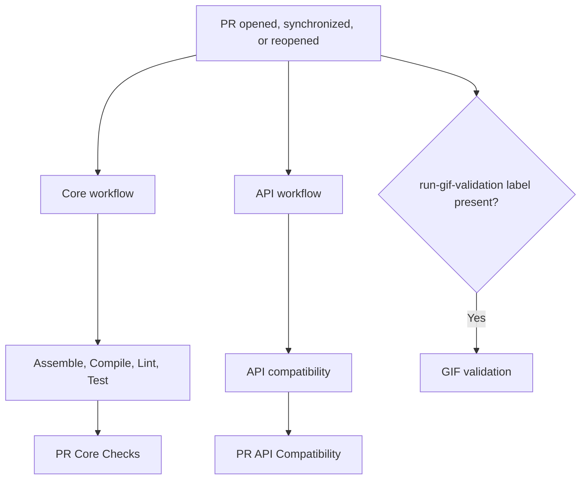

# Pull Request Orchestration

Pull-request CI is split into three independently triggered workflows: core
checks, API compatibility, and optional GIF validation. Core checks and API
compatibility use separate concurrency groups so events for one label cannot
cancel unrelated work. Each workflow uses the immutable `github.sha` for the
pull-request event that started it.

## Labels

- `breaking-change` marks an intentional public API incompatibility. Adding or
  removing this label runs API compatibility, even when the pull request only
  changes documentation or release notes. The label does not start or cancel
  core checks.
- `run-gif-validation` opts a pull request into GIF baseline validation. The
  validation runs for normal pull-request events while this label is present,
  starts when the label is added, and is cancelled when the label is removed.
  It is informational and is not a required status check.

## Flow



The core workflow runs only for the `opened`, `synchronize`, and `reopened`
pull-request actions. Its `PR Core Checks` gate fails if preparation or any
dependent core check fails or is cancelled. Documentation-only changes still
use the reusable workflows' successful no-op path.

The API workflow listens for the same three pull-request actions plus
`labeled` and `unlabeled`. For label actions, only an event for the
`breaking-change` label is relevant. Events for other labels skip `Prepare API
Compatibility` before a runner is allocated. The API result gate derives its
required name and execution eligibility from that preparation result rather
than repeating the event expression.

The GIF workflow is optional. It runs on the three normal pull-request actions
only when the `run-gif-validation` label is present, or when that label is
added. Its `pr-gif-<PR number>` concurrency group cancels an active validation
when the `run-gif-validation` label is removed; the removal event itself does
not start a new validation.

## Workflow responsibilities

| Workflow or job | Responsibility |
| --- | --- |
| `Prepare PR` | Checks out the repository, detects code changes, and records the merge revision for core checks. |
| `Assemble` | Runs `./gradlew ciAssemble`. |
| `Compile` | Runs `./gradlew ciCompile`. |
| `Lint` | Runs Kotlin and build-logic lint when the PR contains code/build changes. |
| `Test` | Runs `ciTestJvm`, `ciTestAndroid`, `ciTestWeb`, and `ciTestIos` when needed; uploads Gradle's native HTML and XML reports. |
| `Prepare API Compatibility` | Routes normal pull-request actions and changes to the `breaking-change` label, detects code changes, and prevents events for other labels from allocating a runner. |
| `API compatibility` | Runs `./gradlew apiCompatibilityCheck`; a detected public API incompatibility requires the `breaking-change` label. |
| `GIF validation` | Runs the opt-in GIF baseline workflow while the `run-gif-validation` label is present. |

Gradle's `chartsTest*` tasks are platform-specific commands for local use. The
`ciTest*`, `ciCompile`, and `ciAssemble` tasks are CI entry points; they define
the exact scope invoked by the reusable workflows. The `smoke-line` consumer
compile belongs only to `ciCompile`, not to a test task.

The core reusable workflows receive `source-sha` from `Prepare PR`. API and
GIF validation receive the triggering event's `github.sha`, so each check uses
the immutable merge result for that event. Core and API workflows retain their
code-change optimization, while changes to the `breaking-change` label force
API compatibility even when no code change is detected.

The repeated API event condition is intentional in only these places:

- `concurrency.group`: relevant API events share `pr-api-<PR number>` and
  events for other labels receive an isolated group.
- `prepare-api.if`: events for other labels do not allocate an API runner.
- the `api-compatibility` reusable-workflow `should-run` input: adding or
  removing `breaking-change` forces the compatibility check.

Downstream API jobs use `needs.prepare-api.result` instead of repeating the
event condition.

## Merge protection

The `protect main` branch ruleset requires only these stable final gates:

```text
PR Core Checks
PR API Compatibility
```

Do not require `Prepare PR`, `Prepare API Compatibility`, individual
implementation jobs, or `PR GIF Baseline Validation`; GIF validation is
optional. Rulesets match status-check contexts literally, so keep the required
names exactly as shown above.

## Fork PR security boundary

All three pull-request workflows run on `pull_request` with read-only
repository permissions. This is where untrusted PR code is checked out and
executed.

Do not move build or test steps to `pull_request_target`; that event has write
access and must not execute untrusted PR code.

## Docs-only changes

`scripts/ci-has-code-changes.sh` treats documentation and release-note-only
changes as non-code changes. For the normal `opened`, `synchronize`, and
`reopened` actions, `Prepare PR` and `Prepare API Compatibility` run, while the
core and API reusable workflows take their successful no-op paths. A
`breaking-change` label addition or removal is the exception: it forces API
compatibility even for a docs-only pull request. Events for other labels skip
API preparation and do not allocate an API runner.

## Troubleshooting

- **The PR cannot merge:** inspect the required status-check names in the
  `protect main` ruleset. Reusable workflows can expose check names differently
  after the first rollout, so use the exact names shown on the PR checks page.
- **Tests fail:** inspect the relevant `PR Test` job logs (JVM, Android, Wasm, or iOS) and download its test-report artifact for Gradle's HTML and XML reports.
- **API compatibility fails:** add the `breaking-change` label only when a
  detected public API incompatibility is intentional; unrelated Gradle or
  compatibility errors are not bypassed by this label.
